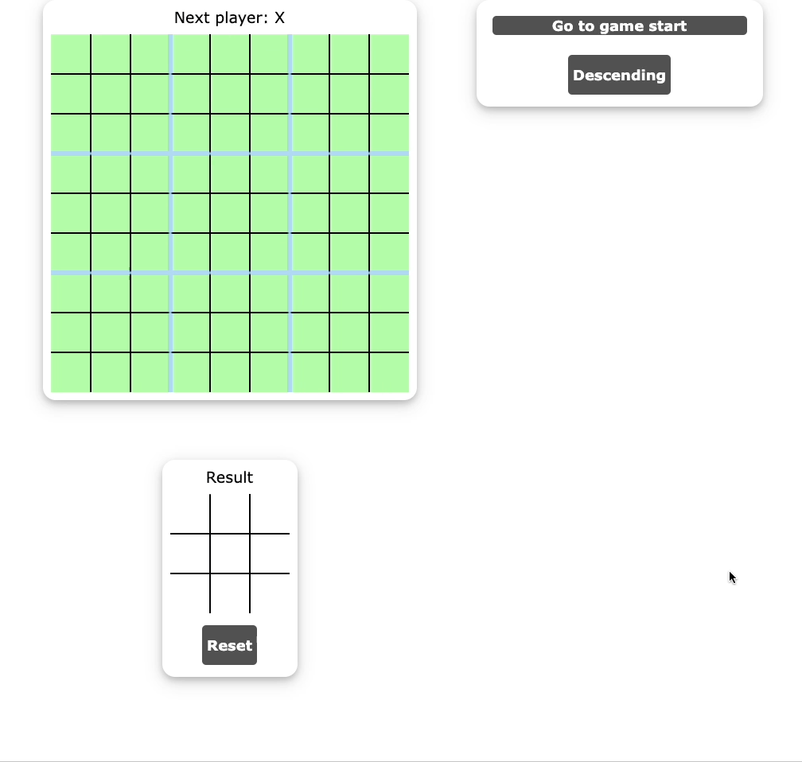

## TicTacToe Ultimate

<!-- TABLE OF CONTENTS -->
<details>
  <summary>Table of Contents</summary>
  <ol>
    <li>
      <a href="#about-the-project">About The Project</a>
    </li>
    <li>
      <a href="#built-with">Built With</a>
    </li>
    <li>
      <a href="#getting-started">Getting Started</a>
    </li>
  </ol>
</details>

<!-- ABOUT THE PROJECT -->
## About The Project

* This project creates an advanced version of the well-known game TicTacToe, called TicTacToe Ultimate! In this version, players try to win the main game by competing in 9 sub-games. The location of each move determines the next sub-game to be played. The game history is saved so that players can undo moves and restart the game from any previous point.



<p align="right">(<a href="#tictactoe-ultimate">back to top</a>)</p>

### Built With

* [![React][React-shield]][React-url]
* [![Vite][Vite-shield]][Vite-url]

<p align="right">(<a href="#tictactoe-ultimate">back to top</a>)</p>

<!-- GETTING STARTED -->
## Getting Started

To get a local copy up and running, follow these steps.

1. If you don't have Node.js, download and install it from https://nodejs.org/en

2. Update npm
   ```sh
   npm install npm@latest -g
   ```

3. Clone the repo
   ```sh
   git clone https://github.com/ALT-Browne/TicTacToeUltimate.git
   ```

4. Install NPM packages
   ```sh
   npm install
   ```

5. Run the project
   ```sh
   npm run dev
   ```

6. Navigate to the url shown in the terminal

<p align="right">(<a href="#tictactoe-ultimate">back to top</a>)</p>

<!-- MARKDOWN LINKS & IMAGES -->
<!-- https://www.markdownguide.org/basic-syntax/#reference-style-links -->
[React-shield]: https://img.shields.io/badge/React-20232A?style=for-the-badge&logo=react&logoColor=61DAFB
[React-url]: https://reactjs.org/
[Vite-shield]: https://img.shields.io/badge/vite-%23646CFF.svg?style=for-the-badge&logo=vite&logoColor=white
[Vite-url]: https://vitejs.dev/
